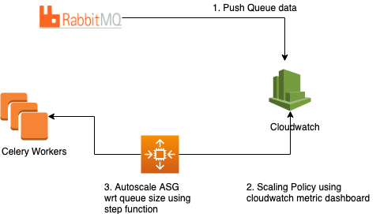

# aws-rabbitmq-celery-scaling

This project demostrate how we can do scaling of rabbitMQ celery workers in AWS.

Infrastructure pre-req's
1. AWS as cloud environment
2. RabbitMQ running on EC2 instance.
3. Celery workers running on ASG (Auto-scaling groups)

Challenge
Challenge is to scale Celery workers depending upon RabbitMQ Queue-size. There is no direct service as such in AWS for RabbitMQ. So we need some solution to capture RabbitMQ queues details and depending upon queue size scale workers.

Solution Design
1. Capture RabbitMQ queues and push to Clouwatch
2. Autoscaling to scale using cloudwatch metric
3. Step-up function to scale on queue metric

Capture RabbitMQ queues and push to Clouwatch
a. Created a Python script using boto3 SDK to query RabbitMQ and push it to Cloudwatch.
